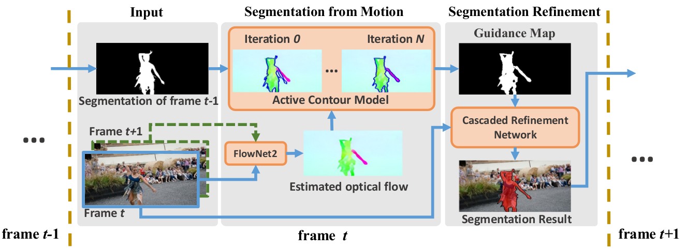

# Motion-Guided-CRN



This is a PyTorch implementation of Motion-guided CRN described in
>[Ping Hu, Gang Wang, Xiangfei Kong , Jason Kuen, Yap-Peng Tan;. "Motion-Guided Cascaded Refinement Network for Video Object Segmentation." CVPR, 2018](https://sites.google.com/view/pinghu/projects/video-object-segmentation)

### Prerequisites
1. PyTorch
2. Opencv

### Installation
1. Clone the Motion-Guided-CRN repository
   ```Shell
   git clone https://github.com/feinanshan/Motion-Guided-CRN.git
   ```
2. Install the Active Contour module
   ```Shell
   cd ./ACLS
   python build.py
   ```
   This module is a C extensions for PyTorch. You may need to install the 'cffi' package from pip.
   
3. Edit the paths in OneShot.py

### Online training and testing
1. Download the [parent model](), and unzip it under `models/`.
2. Edit in file `trainOneShot.py` the 'User defined parameters' (eg. gpu_id, etc).
3. Run `python trainOneShot.py`.

### Testing with trained model
1. The finetuned models can be found [here](), and unzip it under `models/`.
2. Edit in file `TestOneShot.py` the 'User defined parameters' (eg. gpu_id, etc).
3. Run `python TestOneShot.py`.
